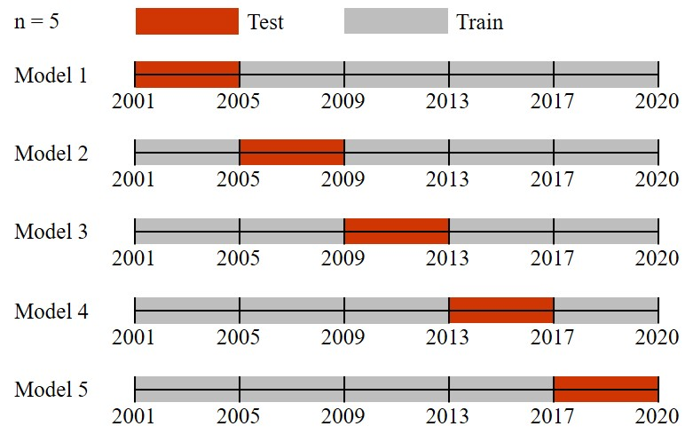

```{r, include = F}
knitr::opts_chunk$set(echo = F)
library(knitr)
library(ggplot2)
library(ggcorrplot)
library(ggrepel)
library(heatmap3)
library(ggpubr)
library(dplyr)

load("./Data/data_1d.Rda")
load("./Data/rf_1d.Rda")
load("./Data/returns_1d.Rda")
R.utils::sourceDirectory("./Code", modifiedOnly = F)
```

# Introduction
Markowitz' Optimization and other models of Finance require estimates of the expected return, the standard deviation and the correlations of individual assets.
These estimates are subject to estimation errors, especially when they are based on short historical time series. This leads to the danger of over- fitting historical data and - in the case of portfolio optimization - of producing portfolios that perform well in backtesting, but perform poorly in the future.
To overcome these problems, several approaches have been proposed. This includes Bayesian approaches, including shrinking Estimators for historical returns, volatilites and correlations. It also includes resampling/bootstrapping approaches, where expected returns, volatilites and correlations are modelled as random variables.
We will analyze a variety of such approaches, identify those that add most value in the context of investment management, and combine/improve them. The goal is a recommended methodology for computing the strategic asset allocation of pension funds and other institutional investors. [@R-base] [@yahoo]
**min. halbe Seite lang**

\newpage

# Data
In this paper, daily historical data from the Swiss Market Index, short SMI, and its constituents is used. The data stems from the period `r format(df[,1][1], "%d.%m.%Y")` to `r format(df[,1][nrow(df)], "%d.%m.%Y")`. The SMI is the most important stock index in Switzerland and contains the 20 largest companies traded on the Swiss stock exchange. It covers approximately 80% of the total market capitalization of the Swiss stock market. The SMI is also a price index which means that dividends are not included. It is reviewed twice a year and, if necessary, reassembled. In this case, the composition per end of 2018 is used. The reason for the 2018 composition is that enough historical data for all companies is available. The key numbers shown in table \@ref(tab:rmrvoltab) are calculated with equations \@ref(eq:logr) and \@ref(eq:vol). [1] [2]

## Logarithmic return
The reason for calculating logarithmic returns is that stock returns are generally assumed to be log-normally and not normally distributed. In later calculations, the risk-free rate of return has to be subtracted from the return and for the sake of simplicity, this is already done from the start. For the risk-free rate $R_{f}$ shown in table \@ref(tab:annrftab), the LIBOR is commonly used. Due to several negative incidents in the past, the Swiss Average Rate Overnight (SARON) is used for the time period 2014 to 2020. The SARON is based on daily transactions and is therefore considerably more transparent compared to the LIBOR. [3] [4]

\begin{equation}
R = R_{ln} - R_{f} = ln\left(\frac{x_{t}}{x_{t-1}}\right) - R_{f}
\label{eq:logr}
\end{equation}

<p> *$R$ = return* <p>
<p> *$R_{ln}$ = natural logarithmic return* <p>
<p> *$R_{f}$ = risk-free rate of return* <p>
<p> *$x_{t}$ = closing stock price at time t* <p>

```{r annrftab}
ann_rf = data.frame(names(rf), rf * 252, row.names = NULL)
kable(ann_rf, col.names = c("Year", "Rate [%]"),
      caption = "Annualized risk-free rate of return",
      digits = 3, booktabs = T, linesep = "")
```

\newpage

## Volatility (standard deviation)
The volatility describes the risk of an asset and is a statistical measure of the dispersion of returns. In general, the higher the volatility, the riskier the asset.

\begin{equation}
\sigma = \sqrt{\frac{\sum_{i = 1}^{n}(R_{i} - \overline{R})^2}{n-1}}
\label{eq:vol}
\end{equation}

<p> *$\sigma$ = volatility (standard deviation)* <p>
<p> *$R$ = return* <p>
<p> *$\overline{R}$ = mean return* <p>
<p> *$n$ = sample size* <p>

```{r rmrvoltab}
r = returns
r_mr_vol = data.frame(colnames(r[-1]), mean_returns(r), volatilities(cov_mat(r)), row.names = NULL)
kable(r_mr_vol, col.names = c("Stock","Return [%]", "Volatility [%]"),
      caption = "Mean return and volatility of SMI constituents",
      digits = 3, booktabs = T, linesep = "")
```

## Covariance and correlation
The covariance is a numerical measure that describes the linear relationship between two variables. In this case, it represents the strength of the relationship between two return time series. The correlation is the standardized covariance and ranges in an interval of $[-1, 1]$ with the diagonal values of a correlation matrix always being one. A value of one or minus one means that the returns of two assets move in the same direction respectively in opposite directions. In Markowitz' portfolio theory the correlation of two assets is an important matter which will be discussed later in chapter&nbsp;\@ref(markovitz).

\newpage

\begin{equation}
cov_{x,y} = \frac{\sum_{i = 1}^{n}(x_{i} - \overline{x})(y_{i} - \overline{y})}{n - 1}
\label{eq:cov}
\end{equation}

<p> *$cov_{x,y}$ = covariance between returns of assets x and y* <p>
<p> *$x$ = return of asset x* <p>
<p> *$y$ = return of asset y* <p>
<p> *$n$ = sample size* <p>

\begin{equation}
\rho_{i,j} = \frac{cov_{i,j}}{\sigma_{i}*\sigma_{j}}
\label{eq:cor}
\end{equation}

<p> *$\rho_{i,j}$ = correlation between returns of assets i und j* <p>
<p> *$cov_{i,j}$ = covariance between returns of assets i und j* <p>
<p> *$\sigma_{i}$ = volatility of return of asset i* <p>
<p> *$\sigma_{j}$ = volatility of return of asset j* <p>

The correlation matrix of all 20 stocks is shown in figure \@ref(fig:corplot). As the SMI only contains stocks that are traded on the Swiss stock exchange, there is a rather high correlation between them. The correlation between companies from the same industry is also higher than between companies from different industries. It can be concluded that economic similarities are reflected in a higher correlation between stocks. A correlation significance test is performed in chapter \@ref(t-statistic).

```{r corplot, fig.cap = "Correlation between SMI constituents", fig.height = 6}
suppressWarnings(suppressMessages(print(gg_cor(cor_mat(r), 2, 8, theme = custom_theme_markdown))))
```

\newpage

## Statistical key numbers

### T-statistic {#t-statistic}
A t-test for the correlation as in equation \@ref(eq:ttest) is conducted to investigate if the true correlation is different from zero. 

\begin{equation}
t = \frac{\rho_{i,j}*\sqrt{n-2}}{\sqrt{1 - \rho_{i,j}^2}}
\label{eq:ttest}
\end{equation}

<p> *$t$ = t-statistic* <p>
<p> *$\rho_{i,j}$ = correlation between return i und j* <p>
<p> *$n$ = sample size* <p>

The null hypothesis says that the correlation is not significantly different from zero and the alternative hypothesis that it is significant different from zero.

<p> *$H_{0}:$ $\rho = 0$* <p>
<p> *$H_{1}:$ $\rho \neq 0$* <p>

```{r}
mincor = round(min(abs(cor_mat(r))), 3)
mincorname = row.names(which(round(cor_mat(r),3) == mincor, arr.ind = TRUE))
tvalue = round(cor.test(r[,-1][,mincorname[1]], r[,-1][,mincorname[2]])[[1]], 3)
```

The test is performed for the two stocks with the smallest correlation which are `r mincorname[1]` and `r mincorname[2]`.

\begin{equation}
  t = \frac{`r mincor`*\sqrt{`r nrow(r)`-2}}{\sqrt{1 - `r mincor`^2}} = `r tvalue`
  \label{eq:secr}
\end{equation}

The obtained result `r tvalue`, when compared to the t-distribution in figure \@ref(fig:tdist), has a p-value clearly below the threshold of $\alpha = 0.05$. Therefore, the null hyptothesis can be rejected meaning that the true correlation is significantly different from zero.

```{r tdist, fig.cap = paste0("t-distribution with ", nrow(r), "-2 degrees of freedom"), fig.height = 3}
seq = seq(-5, 5, 0.01)
ggplot() +
  geom_line(aes(x = seq, y = dt(seq, nrow(r)))) +
  geom_hline(yintercept = 0.05, col = "orangered3", linetype = "dashed") +
  labs(x = "x", y = "P(x)") +
  custom_theme_markdown
```

### Standard error of expected return
In statistics the standard deviation of the sampling distribution is known as the standard error and it provides a statement about the quality of the estimated parameter. The more individual values there are, the smaller is the standard error, and the more accurately the unknown parameter can be estimated.

\begin{equation}
  \sigma_{\overline{R}} = \frac{\sigma}{\sqrt{n}}
  \label{eq:ser}
\end{equation}

<p> *$\sigma_{\overline{R}}$ = standard error* <p>
<p> *$\sigma$ = standard deviation of sample* <p>
<p> *$n$ = sample size* <p>

Figure \@ref(fig:serplot) shows the logarithmic mean return with the standard errors for each stock. It is easy to see that stocks such as *Swisscom* and *Nestle* with low volatility (table \@ref(tab:rmrvoltab)) also have a lower standard error. As well *ABB* and *Credit Suisse* have a high volatility and accordingly show higher values for the standard error.

```{r serplot, fig.cap = 'Expected mean return with standard error', fig.height = 4}
mr = mean_returns(r)
se_r = apply(r[,-1], 2, se_mean)
min = min(mr - se_r); max = max(mr + se_r)
gg_errorbar(stocks, mr, se_r, c(min, max), "Return [%]", theme = custom_theme_markdown)
```

### Standard error of volatility (standard deviation)
This formula is an approximation for the standard error of volatility, which is appropriate for n > 10. [8]

\begin{equation}
  \sigma_{\sigma} = \sigma * \frac{1}{\sqrt{2 * (n - 1)}}
  \label{eq:sev2}
\end{equation}

<p> *$\sigma_{\sigma}$ = standard error* <p>
<p> *$\sigma$ = standard deviation* <p>
<p> *$n$ = sample size* <p>

As shown in table \@ref(tab:sevolrtab) the values of the standard error of volatility are much lower as the ones of the logarithmic mean returns. This behavior will be clearly visible later in chapter \@ref(bootstrap). Furthermore, we will neglect the values for any further calculations since these values can be estimated nearly exactly.

```{r sevolrtab}
se_volr = data.frame(colnames(r[-1]), apply(r[,-1], 2, se_sd), row.names = NULL)
kable(se_volr, col.names = c("Stock", "Standard error [%]"),
      caption = "Standard error of volatility",
      digits = 5, booktabs = T, linesep = "")
```

\newpage

# Review of classical markovitz optimization {#markovitz}
Modern portfolio theory is a theory that deals with the construction of portfolios to maximize the expected return based on a given market risk. Markowitz' portfolio theory shows that efficient risk reduction is only possible if the extent of the correlation of the individual investments is taken into account when putting together the portfolio. Risk reduction through risk diversification is a key finding of the aforementioned portfolio theory. Harry Markowitz pioneered this theory in his article "Portfolio Selection”. The main point is that the risk and return characteristics of an investment should not be considered in isolation, but should be evaluated according to how the investment affects the risk and return of the overall portfolio. It is shown that an investor can construct a portfolio of multiple assets that maximizes returns for a given level of risk. Similarly, an investor can construct a portfolio with the lowest possible risk at a desired level of expected return. Based on statistical measures such as volatility and correlation, the performance of an individual investment is less important than how it affects the portfolio as a whole. [5] 

It is also assumed that the return, volatility and covariance matrix is known. The portfolio volatility is accordingly given as a function of the covariance matrix and the weight vector and it can be minimized as much as desired by sufficient diversification. Also the sum of all weights equals 1. The portfolio weights being searched for are described by the vector $\vec{w} = (w_{1}, \dots, w_{n})$. The weights that are calculated are those weights that match the portfolio with minimal volatility (variance) to a given expected portfolio return $R_{p}$. This is a linear optimization problem, as well a formulation of the fundamental problem of balancing return and risk. Furthermore, in practice negative weightings are defined as short sales. [9]


\begin{equation}
minimize: \frac{1}{2}\vec{w}^\intercal\Sigma\vec{w}
  \label{eq:minimum}
\end{equation}

*With the following two constraints:*

*I.*
\begin{equation}
1 = \vec{w}^\intercal\vec{1}
  \label{eq:constraint1}
\end{equation}

*II.*
\begin{equation}
R_{p} = \vec{w}^\intercal\vec{R}
  \label{eq:constraint2}
\end{equation}

According to the method of the Lagrange Multiplier, the Lagrange function is formed with the factors $\lambda$ and $\epsilon$. 

\begin{equation}
L(\vec{w}) = min \frac{1}{2}\vec{w}^\intercal\Sigma\vec{w} - \lambda(\vec{w}^\intercal\vec{R} - R_{p}) - \epsilon(\vec{w}^\intercal\vec{1} - 1)
  \label{eq:lagrangemw}
\end{equation}

The disappearance of the gradient is the necessary condition for a minimum. This is together with the two constraints (\@ref(eq:constraint1), \@ref(eq:constraint2)) an inhomogeneous linear system of equations of the dimension $n + 2$ with $n + 2$ variables. The solution is a known standard problem from linear algebra.

\begin{equation}
\nabla_{w}L = \Sigma\vec{w} - \lambda*\vec{R} - \epsilon*\vec{1} = 0
  \label{eq:gradient}
\end{equation}


<p> *$\vec{w}$ = weight vector* <p>
<p> *$\Sigma$ = covariance matrix* <p>
<p> *$\vec{1}$ = all-ones vector* <p>
<p> *$\vec{R}$ = return* <p>
<p> *$R_{P}$ = total portfolio return* <p>

\newpage

## Problem
In order to apply the optimization, some assumptions have to be made at the beginning. As already mentioned before, the returns, risk and correlation coefficients must be known. It is also important that the risk is described by the standard deviation. This leads to the conclusion that a normal distribution is irrelevant, because the standard deviation is used as risk. Another condition applies to the linear relationship of the stocks. The log returns must not have a perfect correlation among themselves, neither negative nor positive. This is described by a correlation coefficient of -1 or 1. If the determinant of the correlation matrix is zero, the system cannot be solved. This situation occurs when stocks have a correlation coefficient of 1 or -1. The system must be uniquely solvable to form the inverse of the covariance matrix $\Sigma^{-1}$.

## Minimum variance portfolio 
The minimum variance portfolio, short MVP, describes the portfolio of all possible weightings with the minimum volatility. Since only the volatility is minimized, constraint *II* \@ref(eq:constraint2) is not included in the equation. Negative returns do not necessarily have to result in a negative weighting, since in the calculation of the MVP the return is not directly included in the calculation but only the covariance matrix. Therefore, the correlation coefficients are the important factor. The MVP weights are shown in table \@ref(tab:mvpwrtab).

\begin{equation}
\vec{w}_{mvp} = \frac{1}{\vec{1}^\intercal\Sigma^{-1}\vec{1}}*\Sigma^{-1}\vec{1}
  \label{eq:mvpw}
\end{equation}

<p> *$\vec{w}_{mvp}$ = weights* <p>
<p> *$\vec{1}$ = all-ones vector* <p>
<p> *$\Sigma$ = covariance matrix* <p>

```{r mvpwrtab}
mvpw_r = data.frame(colnames(r[-1]), mvp_weights(cov_mat(r)))
kable(mvpw_r, col.names = c("Stock", "Weight"), caption = "Weights of minimum variance portfolio",
      digits = 3, booktabs = T, linesep = "")
```

\newpage

## Tangency portfolio 
The tangency portfolio, short TP, results from the tangent of the capital market line and the efficient frontier, which will be shown more detailed in chapter \@ref(EF). The capital market line is an important component of the capital asset pricing model (CAPM). The slope of the capital market line indicates how much more return is expected per additional volatility. This is exactly the situation when the capital market line is tangential to the efficient frontier. Therefore, the best possible diversified portfolio results from the weightings of the tangency portfolio. 

The tangency portfolio is often referred to in the literature as the market portfolio. In the equation for the capital market line, shown as equation \@ref(eq:cml), the expected return of the market portfolio respectively the tangency portfolio is written as $R_{tp}$.

*Capital Market Line:*
\begin{equation}
R_{P}(\sigma_{P}) = R_{f} + \frac{R_{tp} - R_{f}}{\sigma_{tp}} * \sigma_{P}
  \label{eq:cml}
\end{equation}

<p> *$R_{P}$ = total portfolio return as a function of $\sigma_{p}$* <p>
<p> *$R_{f}$ = return of risk-free asset* <p>
<p> *$R_{tp}$ = return of tangency portfolio* <p>
<p> *$\sigma_{P}$ = total portfolio volatility* <p>
<p> *$\sigma_{tp}$ = tangency portfolio volatility* <p>

*Tangency Portfolio:*
\begin{equation}
\vec{w}_{tp} = \frac{1}{\vec{1}^\intercal\Sigma^{-1}\vec{R}}*\Sigma^{-1}\vec{R}
  \label{eq:tpw}
\end{equation}

<p> *$\vec{w}_{tp}$ = weights* <p>
<p> *$\vec{1}$ = all-ones vector* <p>
<p> *$\Sigma$ = covariance matrix* <p>
<p> *$\vec{R}$ = return* <p>


```{r tpwrtab}
tpw_r = data.frame(colnames(r[-1]), tp_weights(cov_mat(r), mean_returns(r)))
kable(tpw_r, col.names = c("Stock", "Weight"), caption = "Weights of tangency portfolio",
      digits = 3, booktabs = T, linesep = "")
```

\newpage

## Efficient Frontier {#EF}
The efficient frontier is a set of points that extends in the return-volatility diagram (figure \@ref(fig:refplot)) between the minimum variance portfolio at the left edge of the reachable area and the tangency portfolio. All possible portfolio weights above the MVP on this line are efficient because they have the maximum return at a defined level of volatility.

\begin{equation}
\vec{w}_{tp} = \alpha * \vec{w}_{mvp} + (1 - \alpha) * \vec{w}_{tp}
  \label{eq:efficientf}
\end{equation}

<p> *$\vec{w}_{tp}$ = weights* <p>
<p> *$\alpha$ = scale factor* <p>
<p> *$\vec{w}_{mvp}$ = weights of minimum variance portfolio* <p>
<p> *$\vec{w}_{tp}$ = weight of tangency portfolio* <p>

\begin{equation}
R_{P} = \vec{w}^\intercal * \vec{R}
  \label{eq:cord}
\end{equation}

<p> *$R_{P}$ = total portfolio return* <p>
<p> *$\vec{w}$ = weights* <p>
<p> *$\vec{R}$ = mean return* <p>

\begin{equation}
\sigma_{P} = \sqrt{\vec{w}^\intercal\Sigma\vec{w}}    
  \label{eq:cord2}
\end{equation}

<p> *$\sigma_{P}$ = total portfolio volatility* <p>
<p> *$\vec{w}$ = weights* <p>
<p> *$\Sigma$ = covariance matrix* <p>


```{r refplot, fig.cap = 'Return-volatility diagram with efficient frontier', fig.height = 5}
cm = cov_mat(r); mr = mean_returns(r)
efw_r = ef_weights(mvp_weights(cm), tp_weights(cm, mr), seq(-3, 3, 0.1))
efp_r = ef_points(efw_r, cm, mr)
efp = data.frame(n = stocks, vol = volatilities(cm), mr = mr, row.names = NULL)
suppressMessages(
  suppressWarnings(print(
    ggplot() +
      geom_abline(intercept = 0, slope = tp_point(efp_r)[2]/tp_point(efp_r)[1], alpha = 0.5) +
      geom_path(aes(x = efp_r[,1], y = efp_r[,2]), alpha = 0.5) +
      geom_point(aes(x = mvp_point(efp_r)[1], y = mvp_point(efp_r)[2], color = "MVP")) +
      geom_point(aes(x = tp_point(efp_r)[1], y = tp_point(efp_r)[2], color = "TP")) +
      geom_text_repel(data = efp, aes(x = vol, y = mr, label = n), size = 3) +
      lims(x = c(0, 3), y = c(-0.1, 0.2)) +
      labs(x = "Volatility [%]", y = "Expected return [%]", color = NULL) +
      scale_color_manual(values = c("MVP" = "cornflowerblue", "TP" = "orangered3")) +
      theme(legend.position = "bottom") +
      custom_theme_markdown)))
```


In figure \@ref(fig:refplot) it is clearly visible that the efficient frontier covers the range in which all possible portfolio compositions can be located. Through the optimization, the TP is created, which achieves a significantly higher return than the individual stocks included in the SMI. Also, the MVP is at the extreme left of the achievable area on the efficient frontier, which means that there is no portfolio that have a lower volatility.

\newpage

## Sharpe ratio {#sharpe}
The Sharpe ratio measures the performance of an investment which means the return of an investment compared to its risk. Generally, the greater the value of the Sharpe ratio, the more attractive the portfolio. In practice, the value of the Sharpe ratio is not only positively received. In this paper, however, we will rely on the Sharpe ratio because it is a key figure by which performance can be measured. It is calculated by the average return earned in excess of the risk-free rate per unit of volatility. In this case it is the natural logarithmic return per day $R$ divided by $\sigma$. $R$ is already calculated in equation \@ref(eq:logr). Note that the Sharpe ratio is annualized, which means that it is multiplied by $\sqrt{252}$. [6] [7]

\begin{equation}
  Sharpe ratio = \frac{R_{ln} - R_{f}}{\sigma} = \frac{R}{\sigma}
  \label{eq:sharperatio}
\end{equation}

<p> *$R$ = natural logarithmic return per day* <p>
<p> *$R_{ln}$ = mean logarithmic return* <p>
<p> *$R_{f}$ = risk-free rate of return* <p>
<p> *$\sigma_{i}$ = volatility of return* <p>

# Methodology {#methodology}

## Grouping {#grouping}
Grouping of stocks is an approach to reduce the noise given by individual assets and therefore increase the Sharpe ratio. A more qualitative and a mathematical approach are applied.

### Grouping by industry
An intuitive approach is grouping stocks by industry. In the case of the SMI the stocks can be grouped as follows:

<p> **Consumer:** *Adecco, Nestle, Richemont, Swatch, Swisscom* <p>
<p> **Finance:** *Credit Suisse, Julius Baer, Swiss Life, Swiss Re, UBS, Zurich Insurance* <p>
<p> **Industrial:** *ABB, Geberit, Givaudan, LafargeHolcim, SGS* <p>
<p> **Pharma:** *Lonza, Novartis, Roche, Sika* <p>

To obtain the group returns, the mean value of the daily returns of all stocks within the group is calculated. Therefore, the group returns are a time series equaling the length of the historical data and all stocks within the group are weighted equally. From this time series the mean returns, volatility and correlation matrix can be calculated as shown in table \@ref(tab:grmrvoltab).

```{r grmrvoltab}
gr = groups_returns(returns, groups)
gr_mr_vol = data.frame(colnames(gr[-1]), mean_returns(gr), volatilities(cov_mat(gr)), row.names = NULL)
kable(gr_mr_vol, col.names = c("Group","Return [%]", "Volatility [%]"),
      caption = "Mean returns and Volatility of groups",
      digits = 3, booktabs = T, linesep = "")
```

\newpage

### Grouping with cluster analysis {#groupclust}
In a second approach grouping is based on the similarity measure, which is calculated with Euclidean distances between two correlation coefficients. The formula is illustrated below.

\begin{equation}
  d_{i,j} = \sqrt{\vec{1}^\intercal(\vec{x_{i}} - \vec{x_{j}})^{2}}
  \label{eq:eucledean}
\end{equation}

<p> *$d_{i,j}$ = Euclidean distance between stock i and stock j* <p>
<p> *$\vec{x_{i}}$ = correlation coefficients of stock i (column in corr. matrix)* <p>
<p> *$\vec{x_{j}}$ = correlation coefficients of stock j (column in corr. matrix)* <p>
<p> *$\vec{1}$ = all-ones vector* <p>

When equation \@ref{eq:eucledean} is applied to the correlation matrix shown in figure \@ref{fig:corplot}, it results in a distance matrix with the same dimensions. The algorithm sorts the values of the distance matrix with the complete-linkage method. 

**Step 1**
Group the two stocks with the smallest distance value. 

**Step 2**
Compare the created group with individual stocks or other created groups. The distance between a group $(i,j)$ and a individual stock $k$ is the largest possible distance between a stock within the group and the individual stock.\newline
$d\langle \{i,j\} , k \rangle = max(d\langle i, k \rangle, d\langle j, k \rangle)$. \newline
For distances between groups, the largest possible distance is taken from the distances between each stock of a group with a stock of another group. For distance between group $(i,j)$ and $(k,l)$ with two stocks applies \newline
$d\langle \{i,j\} , \{k,l\} \rangle = max(d\langle i, k \rangle, d\langle i, l \rangle, d\langle j, k \rangle, d\langle j, l \rangle)$.

**Step 3**
Repeat the procedure with the new created distance matrix until only two groups remain. The outcome is a dendogram which is also part of the illustration in figure \@ref(fig:distheatmap). It can be seen that the first step of grouping is the connection which is drawn lowest. The color scaling describes the different distances. [10]

```{r distheatmap, fig.cap = "Grouped by Euclidean distance of correlation coefficients", fig.height = 7}
cor = cor_mat(returns)
heatmap3(as.matrix(dist(cor)), method = "complete", symm = T, margins = c(7, 7),
         col = colorRampPalette(c("orangered4", "orangered2", "honeydew"))(1000))
```

\newpage

<p> **Group 1:** *ABB, Adecco, Credit Suisse, Julius Baer, LafargeHolcim, Richemont, Swatch, Swiss Life, Swiss Re, UBS, Zurich Insurance* <p>
<p> **Group 2:** *Givaudan, Lonza, Nestle, Novartis, Roche, Swisscom* <p>
<p> **Group 3:** *Geberit, SGS, Sika* <p>

Using  cluster analysis, 20 stocks can now be divided into three groups. The dendrogram in figure \@ref(fig:distheatmap) clearly shows the allocation. This division makes mathematical sense, but is hardly ever used in practice. First, the groups are different in terms of number of shares. *Group 1* has eleven stocks, but *Group 3* has only three. This would mean that if all shares within a group are weighted equally, the shares of *Group 3* would be weighted much higher than those of *Group 1*. Second, you would have to explain to an investor why a stock from the industrial sector is grouped with a stock from the financial sector. For example ABB is grouped with UBS but not with Geberit, which is intuitively very contradictory.

Nevertheless, figure \@ref(fig:gefplot) can be used to provide some clarity. This plot underlines the division and makes clear how the groups are formed. The groups contain stocks with similar volatility and return, so it makes sense that ABB is grouped with UBS because of its high risk and not with Geberit.

```{r gefplot, fig.cap = 'Efficient frontier with stocks', fig.height = 5}
g2r = groups_returns(r, groups2)
g2cm = cov_mat(g2r); g2mr = mean_returns(g2r)
efw_g2r = ef_weights(mvp_weights(g2cm), tp_weights(g2cm, g2mr), seq(-3, 3, 0.1))
efp_g2r = ef_points(efw_g2r, g2cm, g2mr)
efp = data.frame(n = c(colnames(r[-1]), colnames(g2r[-1])),
                 vol = c(volatilities(cm), volatilities(g2cm)), mr = c(mr, g2mr), row.names = NULL)
g = c()
for (i in efp$n[1:length(colnames(r[-1]))]) {
  g = c(g, ifelse(identical(
    names(which(setNames(unlist(groups2, use.names = F),
                         rep(names(groups2), lengths(groups2))) == i)), character(0)),
    "Excluded", names(which(setNames(unlist(groups2, use.names = F),
                                     rep(names(groups2), lengths(groups2))) == i))))
}
efp$g = c(g, colnames(g2r[-1]))
suppressMessages(
  suppressWarnings(print(
    ggplot() +
      geom_abline(intercept = 0, slope = tp_point(efp_g2r)[2]/tp_point(efp_g2r)[1], alpha = 0.5) +
      geom_path(aes(x = efp_g2r[,1], y = efp_g2r[,2]), alpha = 0.5) +
      geom_point(aes(x = mvp_point(efp_g2r)[1], y = mvp_point(efp_g2r)[2]), color = "cornflowerblue") +
      geom_point(aes(x = tp_point(efp_g2r)[1], y = tp_point(efp_g2r)[2]), color = "orangered3") +
      geom_text_repel(data = efp, aes(x = vol, y = mr, label = n, color = g), size = 3,
                      key_glyph = draw_key_point) +
      lims(x = c(0, 3), y = c(-0.1, 0.2)) +
      labs(x = "Volatility [%]", y = "Expected return [%]", color = NULL) +
      scale_color_manual(values = c("Group 1" = "forestgreen", "Group 2" = "tan1",
                                    "Group 3" = "darkgray")) +
      theme(legend.position = "bottom") +
      custom_theme_markdown)))
```

Table \@ref(tab:g2rmrvoltab) shows the returns and volatility of the three groups. It is clearly visible that the values have improved on average compared to table \@ref(tab:grmrvoltab). Further methods like k-means or PAM etc. could be considered but are not discussed in this paper.

```{r g2rmrvoltab}
gr_mr_vol = data.frame(colnames(g2r[-1]), mean_returns(g2r), volatilities(cov_mat(g2r)),
                       row.names = NULL)
kable(gr_mr_vol, col.names = c("Group","Return [%]", "Volatility [%]"),
      caption = "groups with expected return and volatility",
      digits = 3, booktabs = T, linesep = "")
```

\newpage

## Bootstrap {#bootstrap}
Bootstrapping is a statistical method of resampling. It allows to create a new sample with drawing from the existing sample. With 100 or more resampled data, each mean and variance of the samples can be analyzed. This method can be used to draw conclusion about a population from its sample.

In this method a bootstrap process is applied to analyze the robustness of the tangency portfolio weights when resampling all historical returns.

**Step 1**
The dates of the historical data are sampled (using `sample()`) in the same dimension, with replacing included. In other words, the row numbers of the historical data are sampled. With the argument `replace = TRUE` ensures, that certain dates, respectively rows can occur multiple times. If replacing would not be included in the sampling method, the correlation matrix would remain constant to the one of the original data.

**Step 2**
A new data set is created with the new sorted dates or row numbers. From each sampled date, the corresponding returns of each stock are added to the new data set, consequently maintaining the daily differences between stocks. This new data set is considered as a bootstrap sample.

**Step 3**
From the bootstrap sample, new mean return of each stock and the corresponding covariance matrix is being calculated. Those two variables are now used as input of the optimization function to calculate minimum variance portfolio and tangency portfolio. The weights of this two portfolios are now being saved in a mvp-weights-matrix and a tp-weights-matrix.

**Step 4**
Repeat the steps 1-3 100 times. This results in two matrices, each with 100 rows of weights. Those MVP and TP weights can now be compared and analyzed. Additionally, the standard deviation of the resulting weights over those number of bootstrap samples can be investigated. The standard deviation is computed with the 84-quantile minus the 50-quantile to achieve a more robust result, because this calculation is less vulnerable to outliers.


In figure \@ref(fig:gg4) all bootstrap samples can be seen with their minimum variance portfolio, tangency portfolio and their efficiency frontier. Noticeable is the variance of the tangency portfolio in comparison to the minimum variance portfolio. This is due to the high standard errors of returns. Since the return is included in the calculation of the TP, but not in the MVP, a larger deviation can be seen.

```{r gg4, fig.cap = 'Bootstrap samples efficiency frontier', fig.height = 4}
bs_r = bootstrap(r); bs_gr = bootstrap(gr)
suppressMessages(suppressWarnings(print(gg_bootstrap_ef(bs_r$samples_ef_points,
                                                        theme = custom_theme_markdown))))
```

\newpage

## Cross validation {#crossvalidation}
Cross validation is a model validation technique for assessing how a model will generalize to an independent data set, i.e., in another time period. The data set is split into a training set used to train the model and a test set to evaluate its performance. This procedure is replicated multiple times until all data was once in the test set.

In this case, the historical data is split into five sections and consequentially five models are trained as depicted in figure \@ref(fig:crossvalidation). The gray sections are the training sets and the red ones the test sets.

```{r crossvalidation, fig.cap = "Cross validation training and test sets", out.width="95%"}

```

In the case of the Markovitz model, the mean returns and covariance matrix of the training set are used to calculate the asset weights. These weights are then applied to the test set asset returns according to equation \@ref(eq:weightedreturn).

\begin{equation}
R_{i,w} = \vec{w}^\intercal * \vec{R_i}
  \label{eq:weightedreturn}
\end{equation}

<p> *$R_{i,w}$ = weighted return day i* <p>
<p> *$\vec{w}$ = asset weights* <p>
<p> *$\vec{R_i}$ = asset returns day i* <p>

At the end of the cross validation, all five test sets are combined into one time series consisting daily weighted returns and equaling the length of the historical data. This time series is entirely out of sample and is used to calculate the Sharpe ratio and hence measure the performance of the model. The implicit assumption behind this procedure is that the returns at different points in time are independent random variables (and, in particular, do not “remember” the past).

It is to note that the training and test sets of the five sections vary significantly in some cases. To give one cause for this, the financial crisis from 2007–2008 can be looked at. During this period, most assets yielded negative returns. For example, model two in figure \@ref(fig:crossvalidation) includes this time period as part of the test set and model four of the training set. This results in fluctuating asset weights across the five models which are illustrated in figure \@ref(fig:tpwbymodel).

\newpage

```{r tpwbymodel, fig.cap = "Tangency portfolio weights by model", fig.height = 5}
is_r = in_sample(r); is_gr = in_sample(gr); is_g2r = in_sample(g2r)
sets_r = cross_validation_sets(r); sets_gr = cross_validation_sets(gr)
sets_g2r = cross_validation_sets(g2r)
os_r = out_of_sample(sets_r); os_gr = out_of_sample(sets_gr); os_g2r = out_of_sample(sets_g2r)
sets_tpw = matrix(ncol = length(sets_r[[1]]), nrow = ncol(r[-1]))
for (i in 1:5) {sets_tpw[,i] = out_of_sample(sets_r, set = i)$tp_weights}
sets_tpw = data.frame(stocks = stocks, sets_tpw)
alpha = 0.2
ggplot(sets_tpw) +
  geom_line(aes(x = stocks, y = X1, group = 1, col = "Model 1"), alpha = alpha) +
  geom_point(aes(x = stocks, y = X1, group = 1, col = "Model 1")) +
  geom_line(aes(x = stocks, y = X2, group = 2, col = "Model 2"), alpha = alpha) +
  geom_point(aes(x = stocks, y = X2, group = 2, col = "Model 2")) +
  geom_line(aes(x = stocks, y = X3, group = 3, col = "Model 3"), alpha = alpha) +
  geom_point(aes(x = stocks, y = X3, group = 3, col = "Model 3")) +
  geom_line(aes(x = stocks, y = X4, group = 4, col = "Model 4"), alpha = alpha) +
  geom_point(aes(x = stocks, y = X4, group = 4, col = "Model 4")) +
  geom_line(aes(x = stocks, y = X5, group = 5, col = "Model 5"), alpha = alpha) +
  geom_point(aes(x = stocks, y = X5, group = 5, col = "Model 5")) +
  labs(x = NULL, y = "Weight", color = NULL) +
  scale_color_manual(values = c("Model 1" = "orangered3", "Model 2" = "cornflowerblue",
                                "Model 3" = "forestgreen", "Model 4" = "tan1",
                                "Model 5" = "darkgray")) +
  guides(fill = guide_legend(ncol = 5)) +
  theme(axis.text.x = element_text(angle = 90), legend.position = "bottom") +
  custom_theme_markdown
```

## Shrinkage {#shrinkage}
Shrinkage is an approach with the objective to increase the out of sample Sharpe ratio by altering the inputs of the Markovitz optimization, namely the mean returns and covariance matrix.

### Shrinkage of mean returns
The shrunk mean returns are calculated as in equation \@ref(eq:shrinkr).

\begin{equation}
\vec{R}(\lambda) = \lambda*\vec{R} + (1 - \lambda) * \vec{\overline{R}}
  \label{eq:shrinkr}
\end{equation}

<p> *$\vec{R}(\lambda)$ = mean returns as a function of $\lambda$* <p>
<p> *$\lambda$ = shrinkage factor* <p>
<p> *$\vec{R}$ = mean returns* <p>
<p> *$\vec{\overline{R}}$ = mean of mean returns* <p>

When the shrinkage factor $\lambda$ is set to one, the mean returns remain unchanged. When it is decreased from one towards zero, the mean returns converge towards their mean value. Once the shrinkage factor $\lambda$ is zero and therefore all mean returns are equal, the tangency portfolio eq. \@ref(eq:tpw) obtains the same asset weights as the minimum variance portfolio eq. \@ref(eq:mvpw).

There is an important constraint in mean returns shrinkage. Take the scaling factor of the tangency portfolio eq. \@ref(eq:tpw) and replace $\vec{R}$ with eq. \@ref(eq:shrinkr) as shown in eq. \@ref(eq:tpwsf).

\begin{equation}
\vec{w}_{tp,sf} = \frac{1}{\vec{1}^\intercal\Sigma^{-1}(\lambda*\vec{R} + (1 - \lambda) * \vec{\overline{R}})}
  \label{eq:tpwsf}
\end{equation}

It is clear that for some value of $\lambda$ the denominator becomes zero. Computationally, it is already problematic if the denominator is close to zero. When setting the denominator equal to zero, the value of $\lambda$ at the zero crossing can be calculated as in eq. \@ref(eq:lambdazero).

\begin{equation}
\lambda_0 = \frac{-\vec{1}^\intercal\Sigma^{-1}\vec{\overline{R}}}{\vec{1}^\intercal\Sigma^{-1}\vec{R} - \vec{1}^\intercal\Sigma^{-1}\vec{\overline{R}}}
  \label{eq:lambdazero}
\end{equation}

If the zero crossing is in the shrinkage interval of $[0, 1]$, this results in extreme asset weights. As the denominator approaches zero, the scaling factor in eq. \@ref(eq:tpwsf) becomes very large which affects the weights. To illustrate this effect, the weights of the five cross validation models from figure \@ref(fig:crossvalidation) are plotted as a function of $\lambda$ in figure \@ref(fig:tpwshrinkbymodel).

```{r tpwshrinkbymodel, fig.cap = "Tangency portfolio weights by model as a function of $\\lambda$", fig.height = 5}
n = ncol(r[-1]); start = 0; stop = 1; size = 0.2
s1 = out_of_sample_vec(sets_r, seq(start, stop, 0.01), set = 1)
out1 = t(sapply(s1, function(x){x$tp_weights}))
s2 = out_of_sample_vec(sets_r, seq(start, stop, 0.01), set = 2)
out2 = t(sapply(s2, function(x){x$tp_weights}))
s3 = out_of_sample_vec(sets_r, seq(start, stop, 0.01), set = 3)
out3 = t(sapply(s3, function(x){x$tp_weights}))
s4 = out_of_sample_vec(sets_r, seq(start, stop, 0.01), set = 4)
out4 = t(sapply(s4, function(x){x$tp_weights}))
s5 = out_of_sample_vec(sets_r, seq(start, stop, 0.01), set = 5)
out5 = t(sapply(s5, function(x){x$tp_weights}))
cm3 = solve(sets_r[[1]][[3]]$cov_mat); mr3 = sets_r[[1]][[3]]$mean_returns
denom_zero = (-rowSums(cm3) %*% rep(mean(mr3), n)) / (rowSums(cm3) %*% mr3 - rowSums(cm3) %*% rep(mean(mr3), n))
gg1 = gg2 = gg3 = gg4 = gg5 = ggplot() +
  scale_x_continuous(breaks = c(0, 0.5, 1)) + custom_theme_markdown
for (i in 1:20) {gg1 = gg1 + geom_line(aes_string(x = seq(start, stop, 0.01), y = out1[,i]),
                                       size = size)}
gg1 = gg1 + labs(x = expression(lambda), y = "Weight", title = "Model 1")
for (i in 1:20) {gg2 = gg2 + geom_line(aes_string(x = seq(start, stop, 0.01), y = out2[,i]),
                                       size = size)}
gg2 = gg2 + labs(x = expression(lambda), y = "Weight", title = "Model 2")
for (i in 1:20) {gg3 = gg3 + geom_line(aes_string(x = seq(start, stop, 0.01), y = out3[,i]),
                                       size = size)}
gg3 = gg3 + geom_vline(xintercept = denom_zero, color = "orangered3") +
  labs(x = expression(lambda), y = "Weight", title = "Model 3")
for (i in 1:20) {gg4 = gg4 + geom_line(aes_string(x = seq(start, stop, 0.01), y = out4[,i]),
                                       size = size)}
gg4 = gg4 + labs(x = expression(lambda), y = "Weight", title = "Model 4")
for (i in 1:20) {gg5 = gg5 + geom_line(aes_string(x = seq(start, stop, 0.01), y = out5[,i]),
                                       size = size)}
gg5 = gg5 + labs(x = expression(lambda), y = "Weight", title = "Model 5")
ggarrange(gg1, gg2, gg3, gg4, gg5)
```

Model three in figure \@ref(fig:tpwshrinkbymodel) shows such extreme asset weights ranging from approximately -20 to 20. The asymptote is visualized as a vertical red line. It is not optimal when such extreme weights are applied to returns as done in the cross validation. This can negatively influence further calculations and lead to undesired results. The other four models do show asset weights in a normal scale.

The scaling factor as a function of $\lambda$ is shown in figure \@ref(fig:tpwsfshrinkbymodel).

```{r tpwsfshrinkbymodel, fig.cap = "Tangency portfolio weights scaling factor by model as a function of $\\lambda$", fig.height = 5}
s1 = out_of_sample_vec(sets_r, seq(start, stop, 0.01), set = 1)
out1 = t(sapply(s1, function(x){1 / (rep(1, n) %*% solve(x$shrinking_cov_mat) %*% x$shrinking_mean_returns)}))
s2 = out_of_sample_vec(sets_r, seq(start, stop, 0.01), set = 2)
out2 = t(sapply(s2, function(x){1 / (rep(1, n) %*% solve(x$shrinking_cov_mat) %*% x$shrinking_mean_returns)}))
s3 = out_of_sample_vec(sets_r, seq(start, stop, 0.01), set = 3)
out3 = t(sapply(s3, function(x){1 / (rep(1, n) %*% solve(x$shrinking_cov_mat) %*% x$shrinking_mean_returns)}))
s4 = out_of_sample_vec(sets_r, seq(start, stop, 0.01), set = 4)
out4 = t(sapply(s4, function(x){1 / (rep(1, n) %*% solve(x$shrinking_cov_mat) %*% x$shrinking_mean_returns)}))
s5 = out_of_sample_vec(sets_r, seq(start, stop, 0.01), set = 5)
out5 = t(sapply(s5, function(x){1 / (rep(1, n) %*% solve(x$shrinking_cov_mat) %*% x$shrinking_mean_returns)}))
gg1 = gg2 = gg3 = gg4 = gg5 = ggplot() + expand_limits(y = 0) +
  scale_x_continuous(breaks = c(0, 0.5, 1)) +  custom_theme_markdown
gg1 = gg1 + geom_line(aes(x = seq(start, stop, 0.01), y = out1[1,]), size = size) +
  labs(x = expression(lambda), y = "Scaling factor", title = "Model 1")
gg2 = gg2 + geom_line(aes(x = seq(start, stop, 0.01), y = out2[1,]), size = size) +
  labs(x = expression(lambda), y = "Scaling factor", title = "Model 2")
gg3 = gg3 + geom_line(aes(x = seq(start, stop, 0.01), y = out3[1,]), size = size) + geom_vline(xintercept = denom_zero, color = "orangered3") +
  labs(x = expression(lambda), y = "Scaling factor", title = "Model 3")
gg4 = gg4 + geom_line(aes(x = seq(start, stop, 0.01), y = out4[1,]), size = size) +
  labs(x = expression(lambda), y = "Scaling factor", title = "Model 4")
gg5 = gg5 + geom_line(aes(x = seq(start, stop, 0.01), y = out5[1,]), size = size) +
  labs(x = expression(lambda), y = "Scaling factor", title = "Model 5")
ggarrange(gg1, gg2, gg3, gg4, gg5)
```

The zero crossing of the scaling factor in model three can be seen clearly. When working with mean returns shrinkage, one has to be aware of this behavior.

\newpage

### Shrinkage of correlation matrix
The shrunk correlation matrix is calculated as in equation \@ref(eq:shrinkcor).

\begin{equation}
\rho_{i,j}(\epsilon) = I_{i,j} + \epsilon * \tilde{\rho}_{i,j}
  \label{eq:shrinkcor}
\end{equation}

<p> *$\rho_{i,j}(\epsilon)$ = correlation matrix at i,j as a function of $\epsilon$* <p>
<p> *$\epsilon$ = shrinkage factor* <p>
<p> *$I_{i,j}$ = identity matrix at i,j* <p>
<p> *$\tilde{\rho}_{i,j}$ = correlation matrix with diagonal zero at i,j* <p>

When the shrinkage factor $\epsilon$ is set to one, the correlation matrix remains unchanged. When it is decreased from one towards zero, the correlation coefficients converge towards zero, except for the diagonal which always remains one. As the tangency portfolio eq. \@ref(eq:tpw) requires the covariance matrix, it is first standardized to the correlation matrix according to eq. \@ref(eq:cor), then shrunk with eq. \@ref(eq:shrinkcor) and scaled up to the covariance matrix again according to eq. \@ref(eq:cor).

There can also arise the case, where for some shrinkage factor $\epsilon$ the denominator of the tangency portfolio eq. \@ref(eq:tpw) becomes zero or close to zero. However, this is not further elaborated on.

# Results
In this section the different approaches which were described in chapter methodology \@ref(methodology) are applied on the historical data. Section \@ref(res1) optimizes the 20 single stocks included in the SMI. Section \@ref(res2) includes the optimization of the different grouping methods. Section \@ref(res3) applies the shrinkage.

## Results of individual SMI constituents {#res1}

```{r tabplot11}
t11 = data.frame(is_r, os_r, row.names = "SMI")
kable(t11, caption = "Sharpe ratio",  digits = 3, 
       booktabs = T, linesep = "", col.names = c("In sample", "Out of sample"))
```


Table \@ref(tab:tabplot11) describes the results of the cross-validation (\@ref(crossvalidation)) method of 20 stocks. As it can be seen and might be expected the in-sample performs much better than the out-of-sample. This is related to the fact that in-sample has the same testing section as training section. which logically results in a high performance considering that the testing data is part of the previous optimized training data. Contrary to the out-of-sample where the testing section is not included in the training section. If a stock behaves differently in this one test section compared to the 4 training sections flowing into the optimization, this stock can be easily over- or underfitted. This leads to a worse Sharpe ratio than the in-sample one. The consequences that can be drawn from this insight is, that firstly the in-sample Sharpe ratio should always be higher than the out-of-sample Sharpe ratio. Secondly, if the two Sharpe ratio differ clearly, the returns of each model differ as well. That means if we have similar returns over 20 years, in- and out-of-sample Sharpe ratio should be closer together, which is not the case here.

<p> In the following two illustrations part of the bootstrap results can be seen. In the graphics the mean weights and the standard deviation over the 100 samples are shown. Figure \@ref(fig:mvpse) shows the MVP weights of the 20 stocks and figure \@ref(fig:tpse) the TP weights.<p>

```{r mvpse, fig.cap = 'MVP weights with standard error', fig.height = 4}
mvpw_r = mvp_weights(cov_mat(r)); mvpw_gr = mvp_weights(cov_mat(gr))
mvpw_sd_r = bs_r$mvp_weights_sd; mvpw_sd_gr = bs_gr$mvp_weights_sd
minmvp = min(c(mvpw_r - mvpw_sd_r, mvpw_gr - mvpw_sd_gr))
maxmvp = max(c(mvpw_r + mvpw_sd_r, mvpw_gr + mvpw_sd_gr))
gg_errorbar(stocks, mvpw_r, mvpw_sd_r, c(minmvp, maxmvp), "Weights", theme = custom_theme_markdown)
```


```{r tpse, fig.cap = 'tangency portfolio weights with standard error', fig.height = 4}
tpw_r = tp_weights(cov_mat(r), mean_returns(r)); tpw_gr = tp_weights(cov_mat(gr), mean_returns(gr))
tpw_sd_r = bs_r$tp_weights_sd; tpw_sd_gr = bs_gr$tp_weights_sd
mintp = min(c(tpw_r - tpw_sd_r, tpw_gr - tpw_sd_gr))
maxtp = max(c(tpw_r + tpw_sd_r, tpw_gr + tpw_sd_gr))
gg_errorbar(stocks, tpw_r, tpw_sd_r, c(mintp, maxtp), "Weights", theme = custom_theme_markdown)
```


## Results of grouped SMI constituents and bootstrapping method {#res2}

```{r tabplot12}
t12 = data.frame(c(is_gr, is_g2r),
                 c(os_gr, os_g2r), row.names = c("Group by industry", "Groups by correlation"))

kable(t12, caption = "Sharpe ratio",  digits = 3,
       booktabs = T, linesep = "", col.names = c("In sample", "Out of sample"))
```

In the above table \@ref(tab:tabplot12) the Sharpe ratio of in- and out-of-sample of the formed groups are presented. The first observation is, that the in-sample value decreased after the grouping method was applied. Optimizing 20 Parameters lead to higher possible variations, therefore this portfolio performs well in-sample. Between the two grouping methods though, the difference in parameters is to small to affect the Sharpe ratio in the way as mentioned before. Other impacts are more significant to the outcome. However the SMI should have the highest in-sample Sharpe ratio because of the numerous parameters.

Nevertheless, the out-of-sample Sharpe ratio has increased. This is because with forming groups, stock returns of companies within the group are being averaged. Consequently, the group return is more stable over the whole time period. As described more detailed in results \@ref(res1), this leads to a better performance respectively a better Sharpe ratio. Therefore, also in- and out-of-sample are here closer together.

In chapter \@ref(groupclust), cluster analysis is used to optimize the group composition. Hence, more correlating stocks are put together to have a more diversifying portfolio. Consequently, the correlation between the groups shrunk in comparison to the correlation between the groups by industry. Further seen in table \@ref(tab:tabplot12), the Sharpe ratio of the new grouping method is much higher than grouping by industries which is a logical consequence of the diversification. In reality though, it is unlikely to invest in such a compiled portfolio, however it was made to find a method for grouping, which affects the Sharpe ratio positively.

Below the second part of bootstrapping results is depicted. As mentioned in section \@ref(res1), the same is shown for the groups. Figure \@ref(fig:mvpsegr) illustrates the MVP weights and figure \@ref(fig:tpsegr) the TP weights.

```{r mvpsegr, fig.cap = 'MVP weights with standard error', fig.height = 4}
gg_errorbar(colnames(gr[-1]), mvpw_gr, mvpw_sd_gr, c(minmvp, maxmvp), "Weights",
            theme = custom_theme_markdown)
```


```{r tpsegr, fig.cap = 'Tangency portfolio weights with standard error by group', fig.height = 4}
gg_errorbar(colnames(gr[-1]), tpw_gr, tpw_sd_gr, c(mintp, maxtp), "Weights",
            theme = custom_theme_markdown)
```

As it is obvious to see and also visualized in figure \@ref(fig:gg4), is that TP weights have a higher standard deviation than MVP weights. That means the TP is more sensible to changes of returns than the MVP is. If the equation \@ref(eq:mvpw) of MVP and the equation \@ref(eq:tpw) of TP are considered, the MVP does not depend on the returns directly. Consequently different returns samples have not a large impact on the MVP. The small differences arise from the varying covariance matrix. But it can also be noticed that this matrix has not large deviations following the standard deviation of the MVP. Therefore bootstrap sampling of the returns does not influence the covariance matrix as much as the returns itself.


## Results of shrinkage method {#res3}

### Shrinkage factors analyzed separately
The Sharpe ratio can be visualized as a function of the shrinking factor. Figure \@ref(fig:srplot) shows such a plot for the mean returns shrinkage factor.

When looking at the SMI curve it can be seen that the highest Sharpe ratio is achieved with a shrinkage factor of about 0.05. This means that the mean returns are shrunk almost completely and therefore there is not much trust in them. This result is plausible, as the returns are very noisy. Further can be seen that the Sharpe ratio has a sharp bend and drop below zero. This is caused by the close to zero denominator of the tangency portfolio \@ref(eq:tpw) as described in chapter \@ref(shrinkage)

For the two group curves the result is inverted. As the grouping of the stocks already reduces the noise significantly, shrinkage does show almost no improvement over non-shrunk mean returns. The groups by correlation do show a significantly higher Sharpe ratio than the grouping by industry and it is also higher than the one of the SMI.

o	Single stock optimization: clear maximum for return shrinking factor 0.05. If past returns are taken too seriously (higher shrinking factor), the out-of-sample Sharpe drops. If they are not considered at all (shrinking factor 0), it also drops. We see that they can be trusted to about 5%.
o	Single stock optimization with 5% return shrinking is better out-of-sample than the best result from forming groups 
o	Single stock optimization: clear maximum for correlation shrinking factor 0.4. If past correlations are taken too seriously (higher shrinking factor), the out-of-sample Sharpe drops. If they are taken less seriously (shrinking factor 0), it also drops. We see that they can be trusted to about 40%.
o	Single stock optimization with 40% correlation shrinking is better out-of-sample than the best result from forming groups

```{r srplot, fig.cap = 'Sharpe ratio as a function of return shrinking factor',fig.height = 4}
os_r_sr = unlist(out_of_sample_vec(sets_r, seq(0, 1, 0.01)))
os_gr_sr = unlist(out_of_sample_vec(sets_gr, seq(0, 1, 0.01)))
os_g2r_sr = unlist(out_of_sample_vec(sets_g2r, seq(0, 1, 0.01)))
gg_shrink2D(list(os_r_sr, os_gr_sr, os_g2r_sr),
            c("SMI", "Groups by industry", "Groups by correlation"), "Return",
            theme = custom_theme_markdown)
```

Figure \@ref(fig:scorplot) shows the same plot for the correlation shrinkage factor. The highest Sharpe ratio for the SMI is achieved with a shrinkage factor of about one third. This result is similar to the one obtained in figure \@ref(fig:srplot) as for the groups shrinkage does not have a great impact.
The highest Sharpe ratio is again achieved by the groups by correlation.

```{r scorplot, fig.cap = 'Sharpe ratio as a function of correlation shrinking factor', fig.height = 4}
os_r_scor = unlist(out_of_sample_vec(sets_r, 1, seq(0, 1, 0.01)))
os_gr_scor = unlist(out_of_sample_vec(sets_gr, 1, seq(0, 1, 0.01)))
os_g2r_scor = unlist(out_of_sample_vec(sets_g2r, 1, seq(0, 1, 0.01)))
gg_shrink2D(list(os_r_scor, os_gr_scor, os_g2r_scor),
            c("SMI", "Groups by industry", "Groups by correlation"), "Correlation",
            theme = custom_theme_markdown)
```

\newpage

### Shrinkage factors analyzed simultaneously
A further visualization is a three dimensional plot where the Sharpe ratio is plotted as a function of both shrinkage factors. The darker the area, the higher the Sharpe ratio.

Figure \@ref(fig:srcorplot1) shows such a plot for the SMI. In the lower and left part of the plot the contour lines are very chaotic which is caused by the Sharpe ratio dropping quickly and below zero. The highest Sharpe ratio is achieved with a mean returns shrinkage factor of about 0.05 and a correlation shrinkage factor of close to one. This matches the result of the previous plots where the mean return shrinkage is better at improving the Sharpe ratio.

```{r srcorplot1, fig.cap = 'SMI Sharpe ratio as a function of return and correlation shrinking factor', fig.height = 4}
grid = expand.grid(seq(0, 1, by = 0.05), seq(0, 1, by = 0.05))
os_r_sr_scor = unlist(out_of_sample_vec(sets_r, grid[,1], grid[,2]))
gg_shrink3D(grid, os_r_sr_scor, theme = custom_theme_markdown)
```

Figure \@ref(fig:srcorplot2) shows the three dimensional plot for the groups by industry and figure \@ref(fig:srcorplot3) for the groups by correlation. Both plots are very similar in their general structure. The groups by industry also show a drop in Sharpe ratio in the lower portion while the groups by correlation does not. Overall, latter do show a Sharpe ratio which is about 0.3 greater than the groups by industry.

**simultaneous shrinking: if returns are shrunk to 5%, then correlation shrinking does not add more value**

```{r srcorplot2, fig.cap = 'Groups Sharpe ratio as a function of return and correlation shrinking factor', fig.height = 4}
os_gr_sr_scor = unlist(out_of_sample_vec(sets_gr, grid[,1], grid[,2]))
gg_shrink3D(grid, os_gr_sr_scor, theme = custom_theme_markdown)
```

```{r srcorplot3, fig.cap = 'Groups Sharpe ratio as a function of return and correlation shrinking factor', fig.height = 4}
os_g2r_sr_scor = unlist(out_of_sample_vec(sets_g2r, grid[,1], grid[,2]))
gg_shrink3D(grid, os_g2r_sr_scor, theme = custom_theme_markdown)
```

Table \@ref(tab:srcomptab) provides an overview over all Sharpe investigated Sharpe ratios, namely in sample (IS), out of sample (OS) and out of sample with applied Shrinkage (OS Shrinkage).

```{r srcomptab}
t20 = data.frame(c(is_r, is_gr, is_g2r),
                 c(os_r, os_gr, os_g2r),
                 c(max(os_r_sr_scor), max(os_gr_sr_scor), max(os_g2r_sr_scor)), row.names = c("SMI", "Groups 4", "Groups 3"))

kable(t20, caption = "Sharpe ratio",  digits = 3,
       booktabs = T, linesep = "", col.names = c("IS", "OS", "OS Shrinkage"))
```

**optimale gewichtungen**


# Conclusion

It can be concluded, that the best improvement of Sharpe ratio is achieved by grouping by correlation with the help of cluster analysis methods. Shrinkage can also improve the Sharpe ratio slightly on already optimized groups and more significantly on ungrouped assets as in the case of the SMI.

Kapitel noch ausbauen, aber Kernaussage ist jene von oben

\newpage

# References

[1] Yahoo Finance, SMI Equities - EBS in CHF [online]. Available from:
https://finance.yahoo.com. [Accessed 28 October 2020]

[2] SIX Group, SMI® – the Blue-Chip Index [online]. Available from:
https://www.six-group.com/exchanges/indices/data_centre/shares/smi_en.html [Accessed 15 October 2020]

[3] SIX Group, Swiss Reference Rates (SARON) [online]. Available from:
https://www.six-group.com/exchanges/indices/data_centre/swiss_reference_rates/reference_rates_en.html [Accessed 30 October 2020]

[4] global-rates, CHF LIBOR interest rate [online]. Available from:
https://www.global-rates.com/en/interest-rates/libor/swiss-franc/swiss-franc.aspx [Accessed 28 October 2020]

[5] H. Makovitz (1952). Portfolio Selection.
The Journal of Finance Vol. 7, No. 1, pp. 77-91 (15 pages). Published By: Wiley.

[6] W. F. Sharpe (1966). Mutual Fund Performance.
The Journal of Business, Vol. 39, No. 1, Part 2: Supplement on Security Prices, pp. 119-138. 
Published by: The University of Chicago Press,

[7] A. W. Lo (2003). The Statistics of Sharpe Ratios.
Sloan School of Management, Massachusetts Instintute of Technology, Cambridge.

[8] Ahn, S. and Fessler, J. (2003). Standard Errors of Mean, Variance and, Standard Deviation Estimators. 
EECS Department, The University of Michigan, pp.1-2.

[9] D. G. Leuenberger (1998). Investment Science. 
Published by: Oxford University Press, New York.

[10] A. Ruckstuhl (2020). Statistisches Data Mining.
School of Engineering, Zurich University of Applied Science

\newpage

# References

<div id="refs"></div>

\listoffigures

\listoftables
